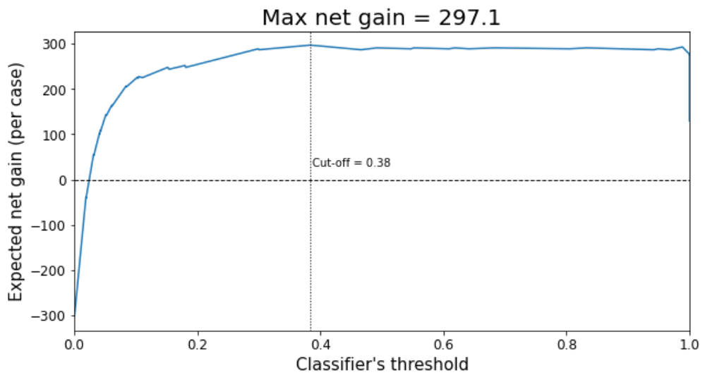

# Classifier cost-gain calculator
Python functions that calculate the expected <b>net gain</b> that will result from the application of a classifier in a commercial setting. 

### Use case
Whenever a classifier is used in a commercial setting there is a cost incurred when the classifier is wrong and a gain (or profit) when the classifier is right. For example, let us imagine a classifier trained to identify customers to include in a marketing email: such a model will generate a profit when it recommends a customer who ends up converting, but it will incur a cost when it recommends a customer who doesn't convert and unsubscribes from future marketing emails.

The functions in this repository make very easy to perform this cost-benefit calculation given a classifier.

### Overview
The functions in this repo let the user calculate the expected net gain (i.e. total gain - total cost) for each value of the classifier's threshold. As inputs, the functions need a quantitative estimate of these costs and gains, as well as data about the classifier out-of-sample performance (y_true and y_score). They also calculate the threshold that maximizes the net gain, providing a <b>problem-specific and business-driven solution to the question of finding the optimal cut-off</b> for a classifier (as opposed to generic approaches such as maximizing F1 score): see screenshot below from the tutorial notebook.

Note: numerical values of costs and benefits are inputs; they need to be derived from the specifics of the commercial application (e.g. in the example of the marketing email they could come from customer life-time value models).

This approach is inspired by the chapter 7 of the book [Data Science for Business](https://learning.oreilly.com/library/view/data-science-for/9781449374273/) by Foster Provost and Tom Fawcett.
